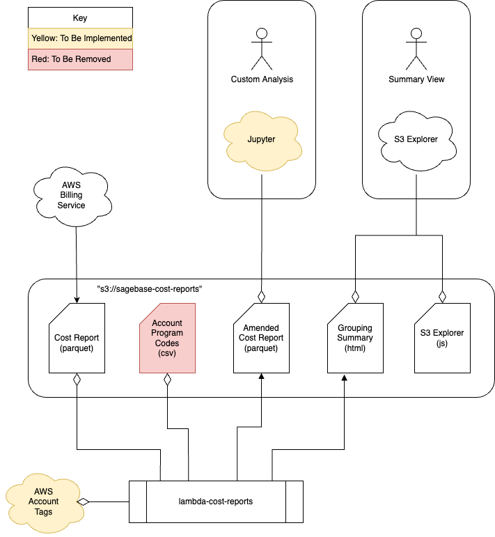

# lambda-cost-reports
A Lambda for generating cost and usage reports grouped by cost center.

## Design

This lambda is designed to analyze the Cost Usage Reports created by AWS Billing,
add additional account tag information, and create a secondary report with
costs grouped by their tagged cost center.

The lambda triggers when AWS Billing updates their parquet artifact
in our S3 bucket (or arbitrarily via API Gateway), and outputs both
an HTML summary and a new parquet dataframe back to the same S3 bucket.

Users can access HTML reports in S3 Explorer, or they can load the amended
parquet data into a Jupyter notebook for custom analysis.

### Architecture



1. The first component is the creation of the Cost Report by AWS Billing,
   configured in [org-formation](https://github.com/Sage-Bionetworks-IT/organizations-infra/blob/master/org-formation/040-budgets/cur.yaml).
   This AWS report is configured as a parquet file with monthly granularity.
1. This lambda is triggered either by S3 object creation for the parquet files
1. This lambda is triggered either by an API Gateway endpoint, or by an S3 event
   proxied through Event Bridge. Event Bridge will only proxy S3 events for creation
   events with S3 keys that match the file written by AWS Billing (based on a
   `.snappy.parquet` file suffix).
   1. When triggered by an API event, the lambda will always regenerate a
      month-to-date report for the current month.
   1. When triggered by an S3 event proxied through Event Bridge, the event
      will be parsed to determine the full S3 key to the created object. If
      the key is determined to be for a previous month, the report will be marked
      as `Complete` rather than `Month-to-Date`.
   1. The lambda reads the parquet file written by AWS Billing and adds a column
      for the calculated cost center. The calculated cost center is calculated
      based on the values of the `CostCenter` and `CostCenterOther` tags for the
      line item, as well as the `CostCenter` and `CostCenterOther` tags on the
      containing account if no valid values are found for the line item.
   1. The resulting data is grouped by the calculated cost center, an HTML summary
      is generated for the grouped data, and then both the HTML summary and the
      amended dataframe are uploaded to S3.

### Planned Changes

1. The initial implementation relies on a static CSV containing Cost Center
   tags for specific accounts. This is planned to be replaced with run-time
   lookups of account tags for all relavent accounts.
1. The initial implementation is only outputting a single summary report
   covering all Program Codes, but additional reports are planned to show
   resource usage for a given Program Code.
1. An automated notification specific to new complete reports will be added
   in a future iteration.

## Development

### Contributions
Contributions are welcome.

### Requirements
Run `pipenv install --dev` to install both production and development
requirements, and `pipenv shell` to activate the virtual environment. For more
information see the [pipenv docs](https://pipenv.pypa.io/en/latest/).

After activating the virtual environment, run `pre-commit install` to install
the [pre-commit](https://pre-commit.com/) git hook.

### Create a local build

```shell script
$ sam build
```

### Run unit tests
Tests are defined in the `tests` folder in this project. Use PIP to install the
[pytest](https://docs.pytest.org/en/latest/) and run unit tests.

```shell script
$ python -m pytest tests/ -v
```

### Run integration tests
Running integration tests
[requires docker](https://docs.aws.amazon.com/serverless-application-model/latest/developerguide/sam-cli-command-reference-sam-local-start-api.html)

```shell script
$ sam local invoke MonthlyCostReportFunction --event events/event.json
```

## Deployment

### Deploy Lambda to S3
Deployments are sent to the
[Sage cloudformation repository](https://bootstrap-awss3cloudformationbucket-19qromfd235z9.s3.amazonaws.com/index.html)
which requires permissions to upload to Sage
`bootstrap-awss3cloudformationbucket-19qromfd235z9` and
`essentials-awss3lambdaartifactsbucket-x29ftznj6pqw` buckets.

```shell script
sam package --template-file .aws-sam/build/template.yaml \
  --s3-bucket essentials-awss3lambdaartifactsbucket-x29ftznj6pqw \
  --output-template-file .aws-sam/build/lambda-template.yaml

aws s3 cp .aws-sam/build/lambda-template.yaml s3://bootstrap-awss3cloudformationbucket-19qromfd235z9/lambda-template/master/
```

## Publish Lambda

### Private access
Publishing the lambda makes it available in your AWS account.  It will be accessible in
the [serverless application repository](https://console.aws.amazon.com/serverlessrepo).

```shell script
sam publish --template .aws-sam/build/lambda-template.yaml
```

### Public access
Making the lambda publicly accessible makes it available in the
[global AWS serverless application repository](https://serverlessrepo.aws.amazon.com/applications)

```shell script
aws serverlessrepo put-application-policy \
  --application-id <lambda ARN> \
  --statements Principals=*,Actions=Deploy
```

## Install Lambda into AWS

### Sceptre
Create the following [sceptre](https://github.com/Sceptre/sceptre) file
config/prod/lambda-template.yaml

```yaml
template_path: "remote/lambda-template.yaml"
stack_name: "lambda-template"
stack_tags:
  Department: "Platform"
  Project: "Infrastructure"
  OwnerEmail: "it@sagebase.org"
hooks:
  before_launch:
    - !cmd "curl https://bootstrap-awss3cloudformationbucket-19qromfd235z9.s3.amazonaws.com/lambda-template/master/lambda-template.yaml --create-dirs -o templates/remote/lambda-template.yaml"
```

Install the lambda using sceptre:
```shell script
sceptre --var "profile=my-profile" --var "region=us-east-1" launch prod/lambda-template.yaml
```

### AWS Console
Steps to deploy from AWS console.

1. Login to AWS
2. Access the
[serverless application repository](https://console.aws.amazon.com/serverlessrepo)
-> Available Applications
3. Select application to install
4. Enter Application settings
5. Click Deploy

## Releasing

We have setup our CI to automate a releases.  To kick off the process just create
a tag (i.e 0.0.1) and push to the repo.  The tag must be the same number as the current
version in [template.yaml](template.yaml).  Our CI will do the work of deploying and publishing
the lambda.
